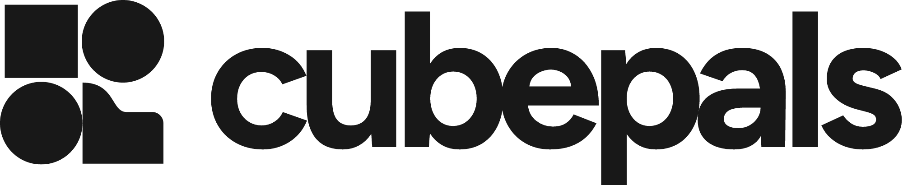

  <a href="https://cubepals.com">
    <picture>
      <source media="(prefers-color-scheme: dark)" srcset="brand/png/lockup-horizontal-reversed.png">
      
    </picture>
  </a>

<strong>A Minecraft server that starts when your friends join.</strong>

  <a href="https://cubepals.com">Website</a> ·
  <a href="https://cubepals.com/pricing">Pricing</a> ·
  <a href="https://cubepals.com/guides">Guides</a> ·
  <a href="docs/architecture.md">Architecture</a> ·
  <a href="CONTRIBUTING.md">Contributing</a>

  
  
  

---

Minecraft server hosting that feels simple: create a server, pick a version, optionally add
mods, copy the address and play. It runs at [cubepals.com](https://cubepals.com).

Inside this repository the project goes by its codename, **Blockly**: the packages, the
`blocklyd` daemon ([its own repository](https://github.com/cubepals/blocklyd)), the infrastructure
and the code all use it. Cubepals is the name players see.

The design lives in [`docs/architecture.md`](docs/architecture.md). Read it before changing a
boundary. To work on it, start with [CONTRIBUTING.md](CONTRIBUTING.md); running it locally is
[`docs/local-development.md`](docs/local-development.md).

## License

Copyright (C) 2026 The Cubepals Authors. The code is free software: you can redistribute it and/or
modify it under the terms of the [GNU Affero General Public License, version 3 only](LICENSE)
(AGPL-3.0-only). It is distributed in the hope that it will be useful, but without any warranty;
see the licence for details. If you run a modified version of Cubepals as a network service, you
must offer its users the source of that version.

The **code** is AGPL. The **brand and the site** are not: the Cubepals name, mark and wordmark,
the landing page, the site's pictures and the guides' words are all rights reserved.
blocklyd, the node daemon, is in its own repository,
[cubepals/blocklyd](https://github.com/cubepals/blocklyd), under FSL-1.1-ALv2.
[LICENSING.md](LICENSING.md) says exactly what is under what, and what to replace if you run your
own.
