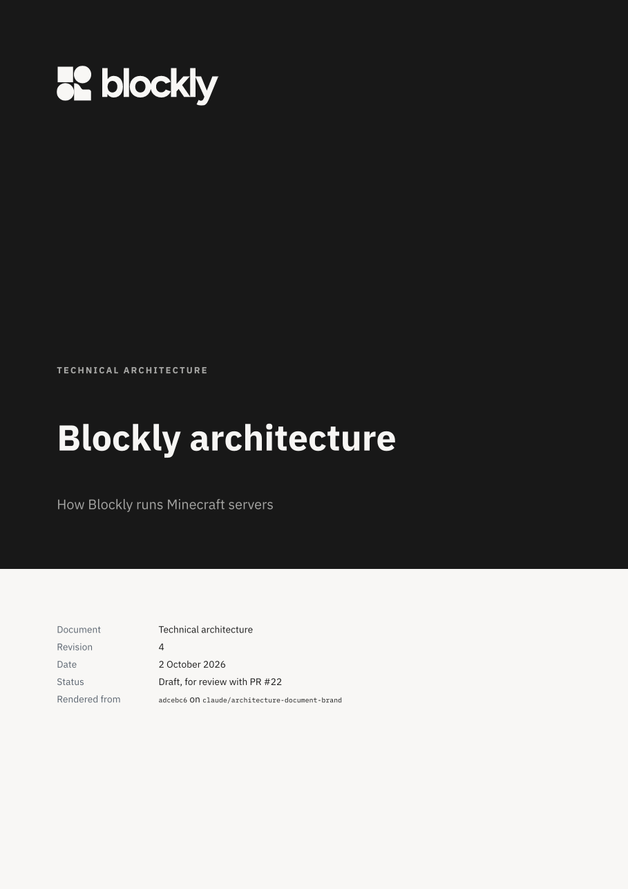
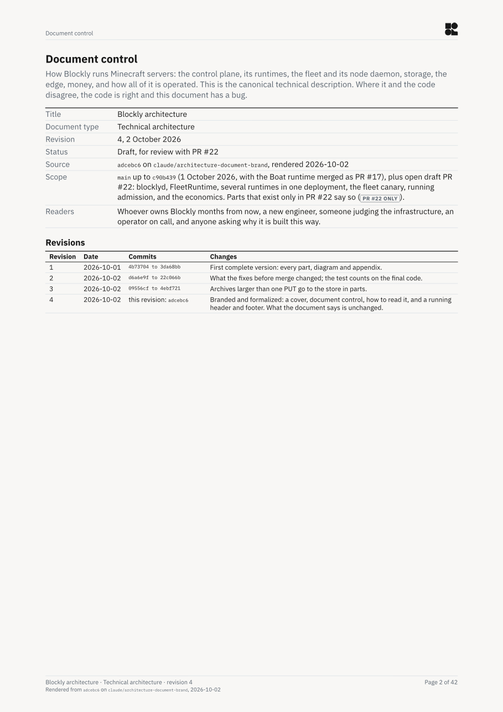
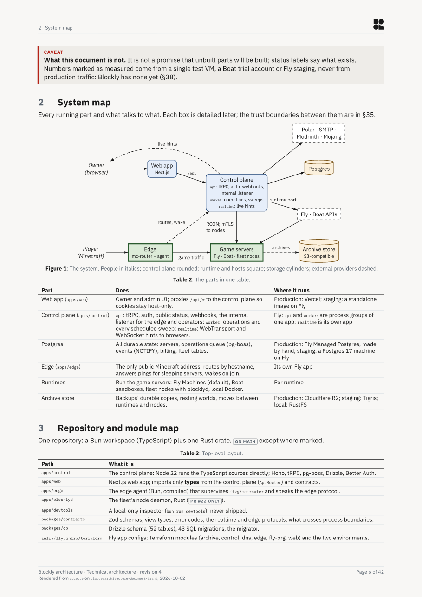

# The architecture document

`Blockly-Architecture.pdf` is the canonical description of how Blockly runs Minecraft servers. This
folder holds its source, in [Typst](https://typst.app):

| File | What it is |
|---|---|
| `Blockly-Architecture.typ` | The document: it includes the parts in order |
| `control.typ` | Document control: title, document type, status, and the revision table |
| `parts/` | One file per part: the cover and front matter (`00-front.typ`), sections, appendices |
| `style.typ` | Brand, colour and type tokens; page, running header and footer, tables, status labels, callouts, and the diagram conventions |
| `fonts/` | IBM Plex Sans and Mono (SIL Open Font License, `fonts/OFL.txt`), so every render matches |

The logo comes from [`brand/`](../../brand/README.md) at render time, never copied here: the
reversed horizontal lockup on the cover's Ink band, and the mark at its 20 px minimum in every
page's header, with a quarter of its height clear around it. Ink `#0D0D0D` on Paper `#F8F7F5`
are the brand's only colourways, and `style.typ` names them, with every other colour, as
tokens. The wordmark is Figtree, carried by the lockups as outlines, and the product and the
films are set in Geologica (`brand/README.md`, "The look around the mark"); the document keeps
IBM Plex, because those rules cover the product, not documents, and Plex has the monospace that
code and citations need. `brand/` is not under the repository's licence
(`brand/LICENSE.md`): a fork must replace it, and so the logo in this document.

## What it looks like

Revision 4: the cover, the document control page, and a page of the body. `--pages`, below, makes
every page as a PNG.

<p>



</p>

## Render it

```sh
bun scripts/architecture.ts            # docs/architecture/Blockly-Architecture.pdf
bun scripts/architecture.ts --pages    # and each page as a PNG in the temp dir, to look at
```

It needs Typst 0.15: `brew install typst`, or `pip install typst==0.15.0` when there is no `typst`
command. The diagram packages, fletcher and chronos, download on first use. The script stamps the
cover and the footer with the commit, branch and date, and says so when the source has uncommitted
changes.

## Keep it true

- The code wins. When the document and the code disagree, fix the document, and cite the code
  (`path:line`) for any claim a reader might doubt.
- Every capability carries a status: `#implemented`, `#canary`, `#designed`, `#deferred`,
  `#research` or `#historical`.
- Diagrams use the helpers in `style.typ`, so the conventions hold: `cp` control plane, `rt`
  runtime and hosts, `st` storage, `ext` external providers, `who` people; solid arrows for calls,
  dashed for periodic or eventual work, dotted for what is only designed. Keep each diagram small.
- Re-render, look at every changed page (`--pages`), and commit the PDF with its source.
- When what the document says changes, add a revision to `control.typ`; the cover, the footer and
  the revision table read it from there.
